# Docker Introduction 🐳

A simple, beginner-friendly guide to Docker — what it is, how it works, and how to use it.
This guide follows the official Docker learning path. For the full official docs, see the reference at the bottom:
👉 https://docs.docker.com/get-started/

---

## Table of Contents

1. [What is Docker?](#1-what-is-docker)
2. [Docker Architecture (Full Picture)](#2-docker-architecture-full-picture)
3. [Docker Concepts](#3-docker-concepts)
   - [3.1 The Basics](#31-the-basics)
   - [3.2 Building Images](#32-building-images)
     - [Understanding Image Layers](#understanding-image-layers)
     - [Writing a Dockerfile](#writing-a-dockerfile)
     - [Build, Tag, and Publish an Image](#build-tag-and-publish-an-image)
     - [Using the Build Cache](#using-the-build-cache)
     - [Multi-Stage Builds](#multi-stage-builds)
   - [3.3 Running Containers](#33-running-containers)
     - [Publishing and Exposing Ports](#publishing-and-exposing-ports)
     - [Overriding Container Defaults](#overriding-container-defaults)
     - [Persisting Container Data](#persisting-container-data)
     - [Sharing Local Files with Containers](#sharing-local-files-with-containers)
     - [Multi-Container Applications](#multi-container-applications)
4. [Reference](#4-reference)
5. [Hands-On Example: Dockerizing a Vite React App](#5-hands-on-example-dockerizing-a-vite-react-app)
6. [Running the Docker Container on an AWS EC2 Instance](#6-running-the-docker-container-on-an-aws-ec2-instance)
   - [6.1 Launch the EC2 Instance](#61-launch-the-ec2-instance)
   - [6.2 Configure the Security Group](#62-configure-the-security-group)
   - [6.3 Connect to the Instance via SSH](#63-connect-to-the-instance-via-ssh)
   - [6.4 Install Docker on EC2](#64-install-docker-on-ec2)
   - [6.5 Get the Project onto the Instance](#65-get-the-project-onto-the-instance)
   - [6.6 Build and Run the Container](#66-build-and-run-the-container)
   - [6.7 Test It from the Browser](#67-test-it-from-the-browser)
   - [6.8 Cleaning Up](#68-cleaning-up)

---

## 1. What is Docker?

Imagine you build an app on your laptop and it works perfectly. But when you send it to your friend, or upload it to a server, it breaks — because their computer has a different setup (different OS, missing libraries, different versions of software).

**Docker solves this problem.**

Docker is a tool that packages your application **and everything it needs to run** (code, libraries, settings, dependencies) into one box called a **container**. That container runs the same way on any computer — your laptop, your teammate's laptop, or a cloud server.

> 💡 Think of it like a **shipping container** for software. No matter what ship (computer) carries it, the contents inside stay the same and work the same way.

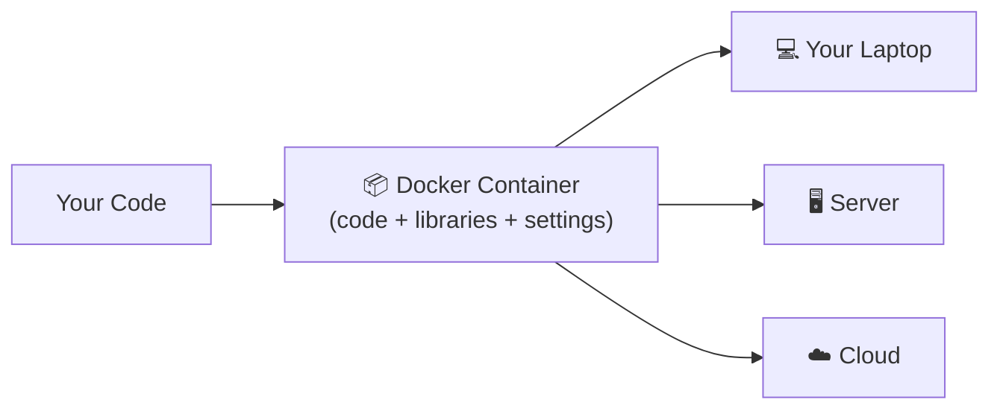

**Why people use Docker:**
- ✅ "It works on my machine" problems disappear.
- ✅ Fast to set up — no manually installing software.
- ✅ Easy to share — send one file (a Dockerfile or image), everyone gets the same environment.
- ✅ Lightweight compared to full virtual machines.

---

## 2. Docker Architecture (Full Picture)

Docker uses a **client-server architecture**. There are three main pieces working together:

| Piece | What it is |
|-------|------------|
| **Docker Client (CLI)** | The tool you type commands into (`docker run`, `docker build`...). It sends your commands to the daemon. |
| **Docker Daemon (`dockerd`)** | The background service that does the real work — building images, running containers, managing networks and volumes. |
| **Docker Registry** | A storage/distribution service for images (e.g. **Docker Hub**). The daemon pulls images from it and can push images to it. |

The Client and Daemon can be on the same machine, or the Client can talk to a Daemon running on a remote machine/server.

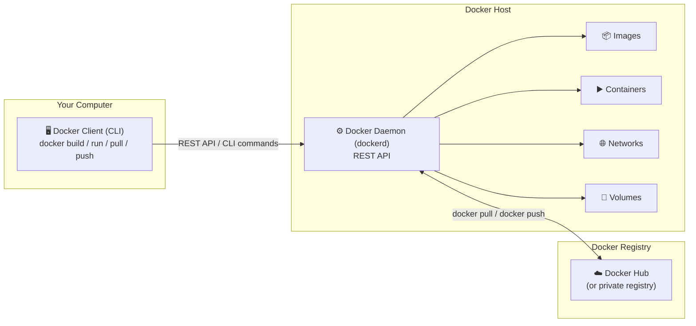

**How a simple command flows through this architecture:**

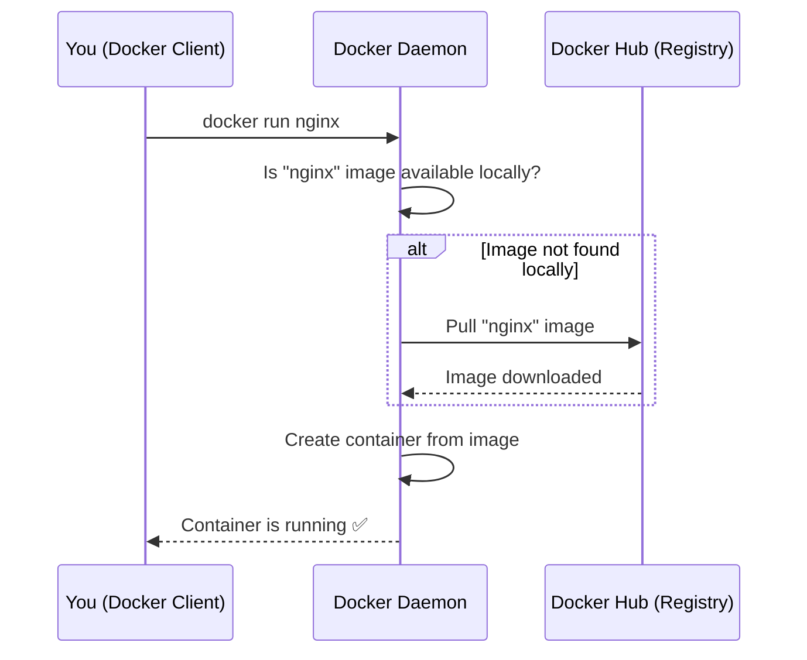

**Underneath the daemon**, Docker relies on operating system features (like Linux namespaces and cgroups) to isolate each container's processes, filesystem, and resources — this is what makes containers lightweight compared to full virtual machines (no separate guest OS per container).

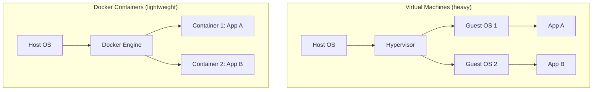

Containers share the host machine's OS kernel, while each VM needs its own full guest OS — that's why containers start faster and use fewer resources.

---

## 3. Docker Concepts

Docker has a few core building blocks. Understanding these makes everything else easy.

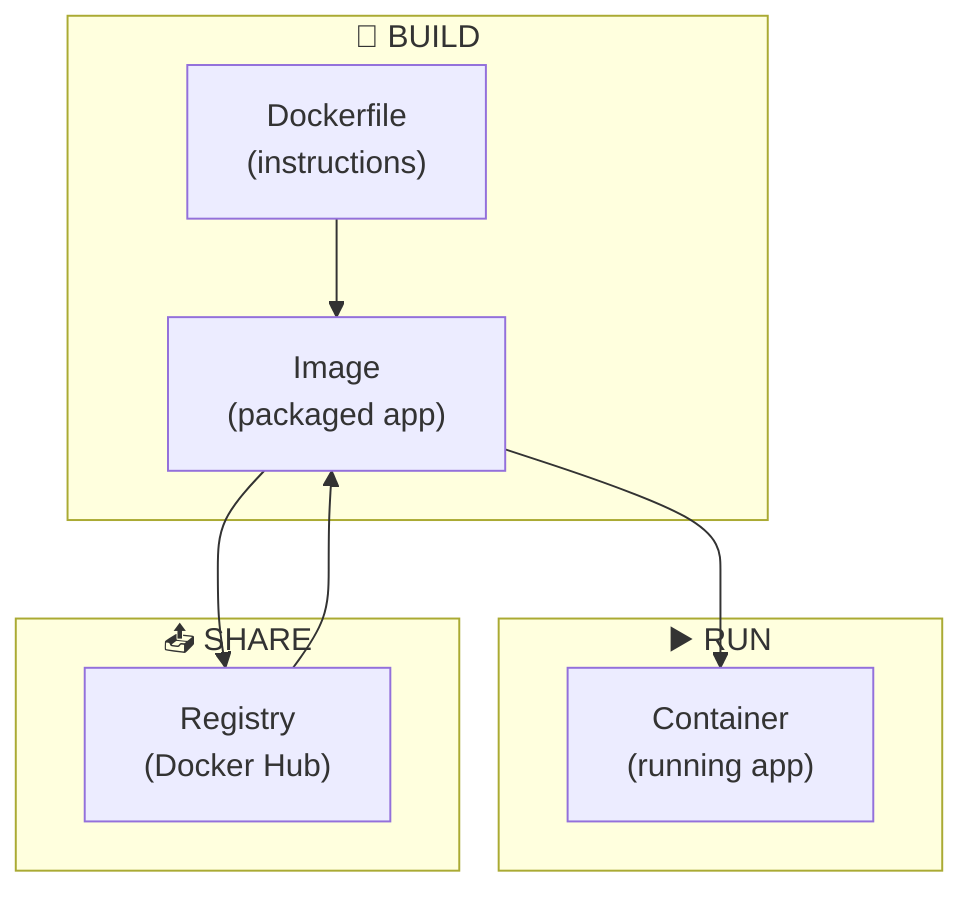

### 3.1 The Basics

There are 3 key terms you must know:

| Term | Simple Meaning |
|------|----------------|
| **Dockerfile** | A text file with step-by-step instructions on how to build your app's image (like a recipe). |
| **Image** | A read-only snapshot/package of your app + everything it needs. Built from a Dockerfile. (like a frozen meal, ready to cook) |
| **Container** | A running instance of an image. This is your app actually running. (the cooked meal, ready to eat) |

**Relationship:**

```
Dockerfile  --(docker build)-->  Image  --(docker run)-->  Container
 (recipe)                       (package)                  (running app)
```

Other basic commands you'll use a lot:

```bash
docker --version        # Check Docker is installed
docker ps                # List running containers
docker images            # List downloaded/built images
docker pull <image>       # Download an image from Docker Hub
docker run <image>        # Run a container from an image
docker stop <container>   # Stop a running container
docker rm <container>     # Remove a stopped container
docker rmi <image>        # Remove an image
```

---

### 3.2 Building Images

An **image** is what you build once and run anywhere. Let's break down how images are made.

#### Understanding Image Layers

A Docker image is not one big file — it's built from **layers stacked on top of each other**. Each instruction in a Dockerfile (like `FROM`, `RUN`, `COPY`) creates a new layer.

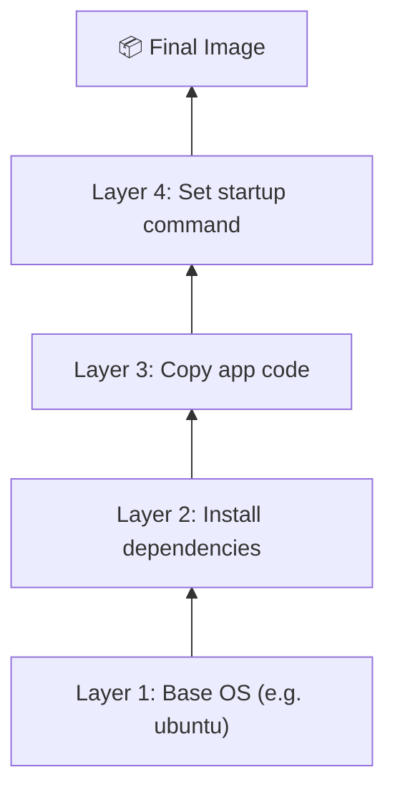

**Why layers matter:**
- Layers are **cached** — if a layer hasn't changed, Docker reuses it instead of rebuilding it. This makes builds much faster.
- Layers are **shared** between images — if two images use the same base layer, Docker only stores it once, saving disk space.

#### Writing a Dockerfile

A `Dockerfile` is a plain text file containing instructions Docker follows to build your image. Example for a simple Node.js app:

```dockerfile
# 1. Start from a base image
FROM node:20-alpine

# 2. Set the working directory inside the container
WORKDIR /app

# 3. Copy dependency files first (for caching benefits)
COPY package*.json ./

# 4. Install dependencies
RUN npm install

# 5. Copy the rest of the app code
COPY . .

# 6. Tell Docker which port the app uses
EXPOSE 3000

# 7. Command to run when the container starts
CMD ["node", "app.js"]
```

**Common Dockerfile instructions:**

| Instruction | Purpose |
|-------------|---------|
| `FROM` | Choose the base image to start from |
| `WORKDIR` | Set the working folder inside the container |
| `COPY` | Copy files from your computer into the image |
| `RUN` | Execute a command while building (e.g. install packages) |
| `EXPOSE` | Document which port the app listens on |
| `CMD` | The default command that runs when the container starts |

#### Build, Tag, and Publish an Image

**Build** an image from your Dockerfile:

```bash
docker build -t my-app:1.0 .
```
- `-t my-app:1.0` → tags (names) the image as `my-app` with version `1.0`
- `.` → tells Docker to look for the Dockerfile in the current folder

**Tag** an image (give it another name, e.g. for a registry):

```bash
docker tag my-app:1.0 myusername/my-app:1.0
```

**Publish (push)** it to Docker Hub so others can pull it:

```bash
docker login
docker push myusername/my-app:1.0
```

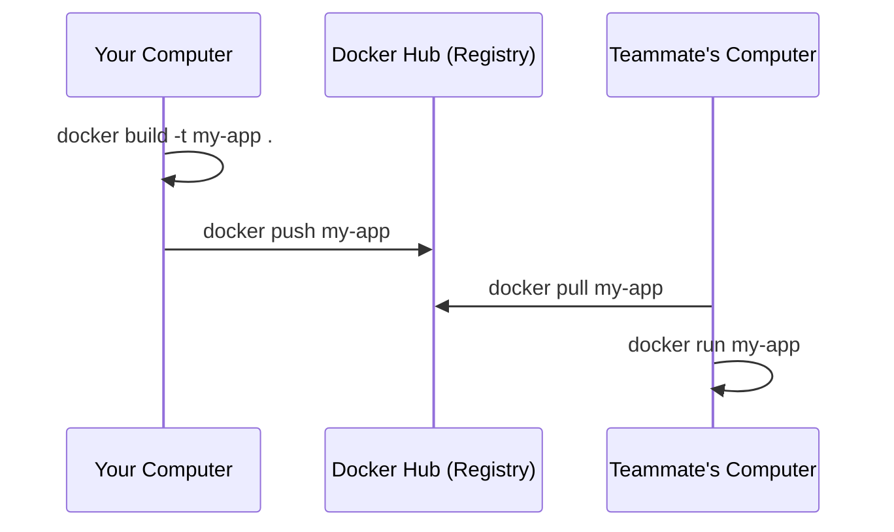

#### Using the Build Cache

Docker rebuilds only the layers that changed, and reuses ("caches") the rest. This is why the **order of instructions in a Dockerfile matters**.

✅ **Good practice:** Copy files that change *less* often (like `package.json`) before files that change *often* (your source code).

```dockerfile
COPY package*.json ./     # changes rarely -> cached most of the time
RUN npm install            # only reruns if package.json changed
COPY . .                   # your code changes often -> put this last
```

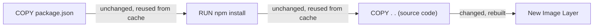

If you put `COPY . .` first, then any tiny code change would invalidate the cache for everything after it — slowing every build down.

#### Multi-Stage Builds

Sometimes you need extra tools to **build** your app (like compilers) but don't want them in your **final** image (to keep it small and secure). Multi-stage builds solve this by using multiple `FROM` steps in one Dockerfile.

```dockerfile
# Stage 1: Build the app
FROM node:20 AS build
WORKDIR /app
COPY . .
RUN npm install && npm run build

# Stage 2: Run the app (small, clean final image)
FROM node:20-alpine
WORKDIR /app
COPY --from=build /app/dist ./dist
CMD ["node", "dist/server.js"]
```

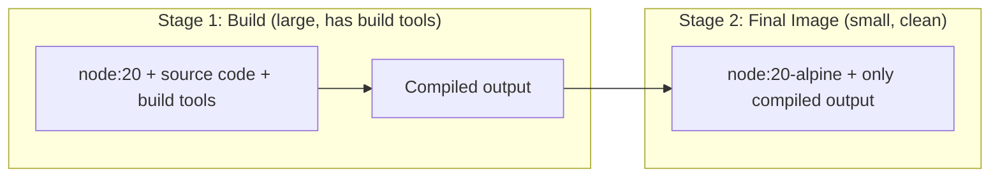

**Result:** a much smaller final image, because build tools and source files are left behind in Stage 1.

---

### 3.3 Running Containers

Once you have an image, you run it as a **container** — a live, working instance of your app.

```bash
docker run my-app:1.0
```

#### Publishing and Exposing Ports

By default, a container is isolated — the outside world can't reach it. To access an app running inside a container (like a web server), you must **publish** a port, mapping a port on your machine to a port inside the container.

```bash
docker run -p 8080:80 my-app
#              ^^^^ ^^
#        host port : container port
```

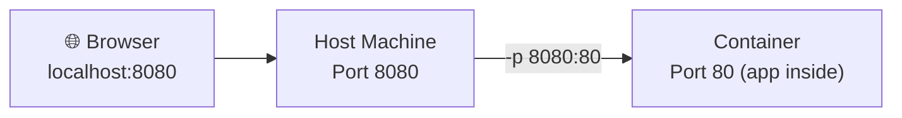

- `EXPOSE` in a Dockerfile is just documentation of which port the app uses.
- `-p` (publish) is what actually makes the port reachable from your computer.

#### Overriding Container Defaults

A Dockerfile's `CMD` sets a default command, but you can override behavior at run time:

```bash
docker run -e APP_ENV=production my-app     # set environment variable
docker run my-app npm run test              # override the default command
docker run --name my-container my-app       # give the container a custom name
```

| Flag | What it Overrides |
|------|--------------------|
| `-e KEY=value` | Environment variables |
| `<image> <command>` | The default `CMD` |
| `--name` | Container's name |
| `--entrypoint` | The default `ENTRYPOINT` |

#### Persisting Container Data

Containers are **temporary** by default — when a container is removed, any data written inside it is lost. To keep data (like a database's files), use **volumes**.

```bash
docker run -v my-data:/var/lib/mysql mysql
#             ^^^^^^^ ^^^^^^^^^^^^^^
#             volume   path inside container
```

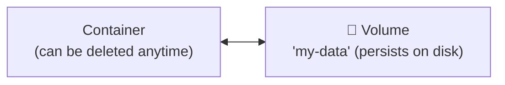

Even if you delete and recreate the container, the volume `my-data` keeps your data safe.

#### Sharing Local Files with Containers

During development, it's useful to let a container see files directly from your computer, using a **bind mount**:

```bash
docker run -v $(pwd):/app my-app
#             ^^^^^^ ^^^^
#          your folder  path inside container
```

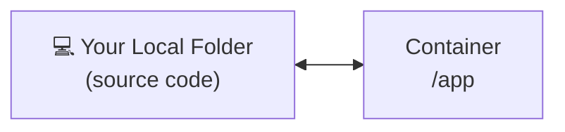

This is great for live-reloading during development — edit code on your machine, and the container sees the change instantly.

**Volume vs Bind Mount (quick comparison):**

| | Volume | Bind Mount |
|---|--------|------------|
| Managed by | Docker | You (a specific folder path) |
| Best for | Persisting data (databases) | Local development (live code editing) |

#### Multi-Container Applications

Real apps often need more than one container — e.g., a web app + a database + a cache. Running and connecting them by hand is tedious, so we use **Docker Compose**, which defines all containers ("services") in one YAML file.

```yaml
# docker-compose.yml
version: "3.9"
services:
  web:
    build: .
    ports:
      - "8080:80"
    depends_on:
      - db
  db:
    image: postgres:16
    environment:
      POSTGRES_PASSWORD: example
    volumes:
      - db-data:/var/lib/postgresql/data

volumes:
  db-data:
```

Run everything with one command:

```bash
docker compose up
```

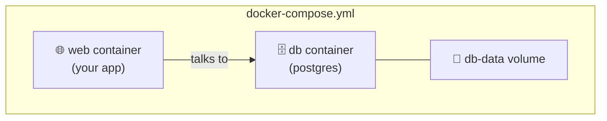

Docker Compose automatically creates a private network so containers can talk to each other by service name (e.g., `web` connects to `db` using the hostname `db`).

---

## 4. Reference

This guide is a simplified summary based on Docker's official documentation. For deeper detail, hands-on tutorials, and up-to-date instructions, always check the official source:

📖 **Docker Official Get Started Guide:** https://docs.docker.com/get-started/

Additional official resources:
- Dockerfile reference: https://docs.docker.com/reference/dockerfile/
- Docker Compose docs: https://docs.docker.com/compose/
- Docker Hub (image registry): https://hub.docker.com/

---

## 5. Hands-On Example: Dockerizing a Vite React App

This repo includes a small real-world test case to try out everything above: a minimal **Vite + React** app, containerized with Docker.

### Step 1: Get a React project

Either create a brand new one with Vite:

```bash
npm create vite@latest
```

Or clone an existing React app (this is the one used in this example):

```bash
git clone https://github.com/udarakalpana/test-app1.git
```

Open the project folder in your favorite IDE or text editor, open a terminal in it, then install dependencies:

```bash
npm i
```

At this point you can run it normally (`npm run dev`) and view it in the browser — but it isn't dockerized yet.

### Step 2: Create the Dockerfile

To containerize the app, two files are needed in the app root: `Dockerfile` and `.dockerignore`.

Create the `Dockerfile` (it's good practice to create/edit it with a CLI text editor like `nano`, to avoid syntax issues from other editors):

```bash
touch Dockerfile
nano Dockerfile
```

Add this configuration:

```dockerfile
FROM node:20-alpine

WORKDIR /app

COPY package.json package-lock.json ./

RUN npm install

COPY . .

EXPOSE 5173

CMD ["npm", "run", "dev", "--", "--host"]
```

- `--host` is required so Vite binds to `0.0.0.0` instead of just `localhost` — otherwise the app is unreachable from outside the container.

Save and exit `nano`:

```
CTRL + O   (write out / save)
Enter      (confirm filename)
CTRL + X   (exit)
```

### Step 3: Create the .dockerignore

```bash
touch .dockerignore
nano .dockerignore
```

Add this configuration, so these files/folders are excluded from the build context:

```
node_modules
dist
.git
Dockerfile
```

Save and exit the same way (`CTRL + O`, `Enter`, `CTRL + X`).

### Step 4: Build the image

```bash
docker build -t test-app1 .
```

### Step 5: Run the container

```bash
docker run -d --name test-app1-container -p 5173:5173 test-app1
```

### Step 6: Test it

Open http://localhost:5173 in your browser — you should see the app running.

**Useful checks while testing:**

```bash
docker ps                             # confirm the container is Up
docker logs test-app1-container       # see the Vite server output
docker stop test-app1-container       # stop it
docker start test-app1-container      # start it again
```

If `localhost:5173` refuses to connect, check `docker ps` first — the container may have stopped, in which case `docker start test-app1-container` brings it back.

### Step 7: Push the image to Docker Hub

Once the image builds and runs correctly, you can publish it to [Docker Hub](https://hub.docker.com/) so it can be pulled and run anywhere.

**Option A — using the CLI:**

```bash
docker login
```

Tag the image with your Docker Hub username:

```bash
docker tag test-app1 <your-dockerhub-username>/test-app1:latest
```

Push it:

```bash
docker push <your-dockerhub-username>/test-app1:latest
```

**Option B — using Docker Desktop:**

1. Open **Docker Desktop** and go to the **Images** tab.
2. Find `test-app1` in the list of local images.
3. Click the **⋮** (more options) menu next to it and choose **Push to Hub**.
4. If prompted, sign in to your Docker Hub account.
5. Confirm the repository name (e.g. `<your-dockerhub-username>/test-app1`) and push.

Once pushed, anyone can pull and run it:

```bash
docker pull <your-dockerhub-username>/test-app1:latest
docker run -d --name test-app1-container -p 5173:5173 <your-dockerhub-username>/test-app1:latest
```

---

## 6. Running the Docker Container on an AWS EC2 Instance

This section covers the full A–Z process of taking the image built earlier (either the local `test-app1` image or the one pushed to Docker Hub) and running it on a real cloud server using **AWS EC2**.

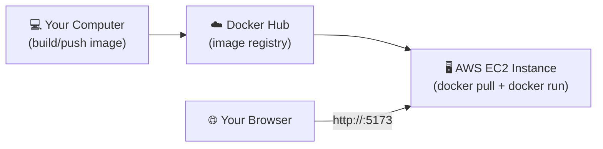

### 6.1 Launch the EC2 Instance

1. Log in to the **AWS Console** → go to **EC2** → **Launch Instance**.
2. **Name**: e.g. `docker-test-app1`.
3. **AMI (OS image)**: choose **Ubuntu Server 22.04 LTS** (Free Tier eligible).
4. **Instance type**: `t2.micro` (Free Tier eligible).
5. **Key pair**: create a new key pair (e.g. `docker-app-key.pem`) and download it — this is required to SSH in later. Keep this file safe; it can't be re-downloaded.
6. **Network settings**: leave default VPC/subnet, but security group rules are configured in the next step.
7. **Storage**: default 8 GB is enough for this test app.
8. Click **Launch Instance**.

### 6.2 Configure the Security Group

By default, an EC2 instance is locked down. You need to open the ports required to SSH in and to reach the app.

| Type | Protocol | Port Range | Source | Purpose |
|------|----------|------------|--------|---------|
| SSH | TCP | 22 | My IP (recommended) | Connect to the instance remotely |
| Custom TCP | TCP | 5173 | Anywhere (0.0.0.0/0) | Reach the Vite app in the browser |

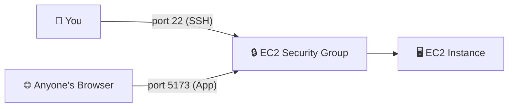

> ⚠️ Restricting SSH (port 22) to "My IP" is safer than "Anywhere" — it stops random bots on the internet from even attempting to log in.

### 6.3 Connect to the Instance via SSH

From your local machine, in the folder where the `.pem` key was downloaded:

```bash
chmod 400 docker-app-key.pem
ssh -i docker-app-key.pem ubuntu@<EC2-Public-IP>
```

- `<EC2-Public-IP>` is shown on the instance's details page in the AWS Console.
- `ubuntu` is the default user for Ubuntu AMIs.

### 6.4 Install Docker on EC2

Once connected via SSH, install Docker on the fresh Ubuntu instance:

```bash
sudo apt update
sudo apt install -y docker.io
sudo systemctl enable --now docker
```

Allow running `docker` without `sudo` every time (optional, but convenient):

```bash
sudo usermod -aG docker $USER
```

Log out and reconnect (`exit`, then SSH in again) for the group change to apply, then confirm:

```bash
docker --version
docker ps
```

### 6.5 Get the Project onto the Instance

There are two ways to get the app + Dockerfile onto the EC2 instance:

**Option A — Clone from GitHub (build on EC2):**

```bash
git clone https://github.com/KanishkaSemalPerera/Docker-Introduction.git
cd Docker-Introduction
```

**Option B — Pull the pre-built image from Docker Hub (no build needed):**

```bash
docker pull <your-dockerhub-username>/test-app1:latest
```

Option B is faster since the image is already built — it skips `npm install` entirely on the server.

### 6.6 Build and Run the Container

**If you cloned the repo (Option A),** build the image on the instance:

```bash
docker build -t test-app1 .
```

**Either way**, run the container the same way as on your local machine:

```bash
docker run -d --name test-app1-container -p 5173:5173 test-app1
```

(If you pulled from Docker Hub instead, use `<your-dockerhub-username>/test-app1:latest` as the image name.)

Confirm it's up and the port is published:

```bash
docker ps
```

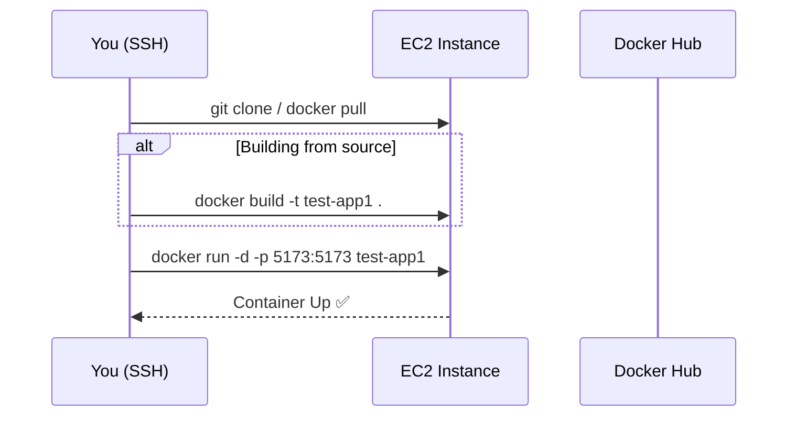

### 6.7 Test It from the Browser

Open in your browser:

```
http://<EC2-Public-IP>:5173
```

You should see the same "Hello Docker I'm Kanishka" app that ran locally — now served from the cloud.

**If it doesn't load, check:**

| Problem | Likely Cause |
|---------|--------------|
| Connection times out | Security group is missing the port 5173 inbound rule (see [6.2](#62-configure-the-security-group)) |
| Connection refused | Container isn't running, or wasn't started with `-p 5173:5173` — check with `docker ps` |
| SSH fails to connect | Wrong key file, wrong username, or port 22 not open for your IP |

### 6.8 Cleaning Up

To avoid ongoing AWS charges once you're done testing:

```bash
docker stop test-app1-container
docker rm test-app1-container
```

Then, in the AWS Console: **EC2 → Instances → select instance → Instance State → Terminate**.

> 💡 Free Tier only covers `t2.micro` for a limited number of hours per month — terminate instances you're not using to avoid surprise charges.
